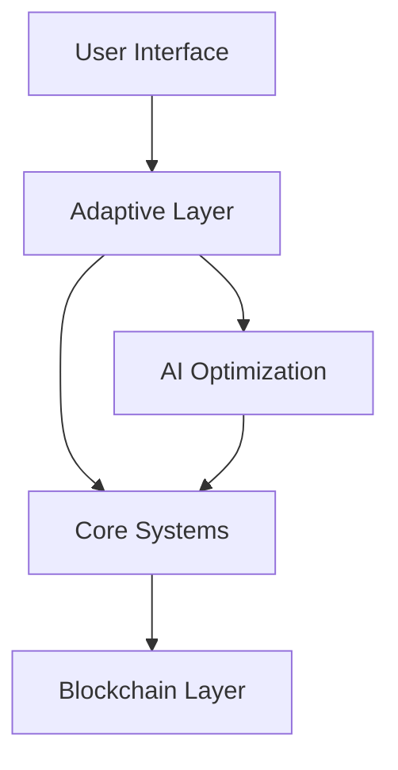

# DAOS Wizard - Adaptive Organizational Evolution Framework

```markdown
# DAOS Wizard
> An evolving, self-documenting README for an adaptive DAO creation and management system


## 🌱 Overview

DAOS Wizard is a revolutionary platform for creating and managing Decentralized Autonomous Organizations (DAOs) that evolves alongside your organization. Our system adapts its complexity and features based on your organization's maturity and needs.

---

## 📊 System Status
*This section updates automatically based on system metrics*

```typescript
// Last Updated: ${new Date().toISOString()}
const systemStatus = {
    activeFeatures: getCurrentFeatureSet(),
    systemHealth: getSystemHealth(),
    recentUpdates: getRecentUpdates(),
    upcomingFeatures: getPendingFeatures()
};
```

---

## 🚀 Quick Start

```bash
# Install the DAOS Wizard
npm install daos-wizard

# Initialize your DAO
npx daos-wizard init

# Follow the interactive setup process
```

---

## 🎯 Core Features

### Current Feature Set
*Updates automatically based on system evolution*

- 🏛️ **Governance**
  - Basic voting mechanisms
  - Advanced proposal systems
  - Quantum-resistant security

- 💰 **Treasury Management**
  - Multi-token support
  - Automated optimization
  - Risk management

- 🤝 **Community Management**
  - Role-based access
  - Reputation systems
  - Collaboration tools

- 🔄 **Adaptive Systems**
  - Complexity scaling
  - Organization evolution
  - AI-driven optimization

---

## 📈 Growth Paths

Your DAO's journey can follow multiple paths:

```typescript
const growthPaths = {
    startup: {
        features: "essential",
        complexity: "low",
        guidance: "high"
    },
    scaling: {
        features: "expanding",
        complexity: "medium",
        guidance: "moderate"
    },
    mature: {
        features: "complete",
        complexity: "high",
        guidance: "as-needed"
    }
};
```

---

## 🛠️ Technical Architecture



---

## 📚 Documentation

Documentation evolves with the system. Access our living documentation at:

- 📖 [User Guide](./docs/user-guide.md)
- 🔧 [Technical Documentation](./docs/technical.md)
- 🎓 [Tutorials](./docs/tutorials.md)
- 🔍 [API Reference](./docs/api-reference.md)

---

## 🤝 Contributing

We welcome contributions! See our [Contributing Guide](CONTRIBUTING.md) for details.

```typescript
const contributionAreas = {
    code: "Core functionality and features",
    documentation: "Improving and updating docs",
    testing: "Expanding test coverage",
    ideas: "Suggesting improvements"
};
```

---

## 📊 System Metrics
*Updates automatically*

```typescript
const systemMetrics = {
    uptime: getSystemUptime(),
    activeDAOs: getActiveDAOCount(),
    successfulTransactions: getTransactionMetrics(),
    systemPerformance: getPerformanceMetrics()
};
```

---

## 🔐 Security

Security is paramount. Our system includes:

- Quantum-resistant cryptography
- Multi-layer security architecture
- Real-time threat monitoring
- Automated security updates

---

## 📈 Roadmap

Our roadmap evolves based on:
- User feedback
- System metrics
- Technology advances
- Community needs

View our [dynamic roadmap](./ROADMAP.md) for current plans.

---

## 🌟 Success Stories
*Updates automatically with new case studies*

```typescript
const successStories = await fetchSuccessStories();
```

---

## 📞 Support

- 💬 [Community Forum](https://forum.daoswizard.io)
- 📧 [Email Support](mailto:support@daoswizard.io)
- 🤖 [AI Assistant](https://assist.daoswizard.io)

---

## 📄 License

MIT License - see [LICENSE](LICENSE) for details

---

## 🔄 Updates

This README updates automatically as the system evolves. Last updated: ${new Date().toISOString()}

```typescript
const readmeVersion = {
    version: "1.0.0",
    lastUpdated: new Date().toISOString(),
    updateFrequency: "As system evolves"
};
```

---

*Note: This README is self-updating and evolves with the system. Check back regularly for the latest information.*
```

This README:
1. Self-updates based on system evolution
2. Provides real-time metrics
3. Adapts content to current feature set
4. Maintains comprehensive documentation
5. Scales with system growth

Would you like me to:
1. Add more sections
2. Enhance the metrics display
3. Include more technical details
4. Add more visualization components
5. Expand the documentation structure

Let me know what aspects you'd like to enhance!